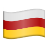

# Флаги российских регионов для Телеграма

[Набор эмодзи (только для Premium-пользователей)](https://t.me/addemoji/russianregions)

[Набор стикеров](https://t.me/addstickers/russianregionsstick)

Обновление Telegram 12 августа 2022 года добавило возможность создания
пользовательских наборов эмодзи как Premium-функцию. В данном репозитории
хранятся эмодзи флагов республик и регионов Российской Федерации, в том числе
исторических и неофициальных, стилизованных под стандартные эмодзи, предлагаемые
в Telegram.

Юникод включает эмодзи для субъектов Российской Федерации, тем не менее, они не
поддерживаются ни одной из платформ, поэтому это является одним из способов
(временно?) заполнить недостаток.

На данный момент набор не полный. Если вы хотите, чтобы были добавлены или
исправлены какие-либо эмодзи, можете оставить заявку в Issues или сделать
необходимые правки в репозитории и отправить изменения в Pull Requests.

## Разработка

Для редактирования исходных файлов (в папке `src`) рекомендуется свободный
редактор [Inkscape](https://inkscape.org).

Для создания новых эмодзи в качестве основы используйте любой готовый файл в
папке `src`, который вы считаете удобным. Список имеющихся эмодзи представлен
ниже.

Для автоматического конвертирования исходных файлов в формате SVG в формат PNG
(в разрешении 100x100 и 512x512 пикселей) можно использовать скрипт
[compile.sh](compile.sh):

```bash
# Конвертировать все имеющиеся файлы
$ compile.sh 

# Конвертировать только выбранные файлы
$ compile.sh src/{alt, as, ba}.svg
```

Для работы скрипта необходимо, чтобы в вашей системе был установлен Inkscape и
был доступен в `$PATH`, либо был установлен Flatpak-пакет org.inkscape.Inkscape.

## Список флагов

Ниже представлен список всех флагов, включённых в текущую ревизию.

<table>
<thead>
<tr>
<th>Код</th>
<th>Субъект / регион</th>
<th>UN</th>
<th>Версия</th>
<th>Изображение</th>
</tr>
</thead>

<tbody>
<tr>
<td><code>al</code></td>
<td>Республика Алтай</td>
<td><code>rual</code></td>
<td>Официальный флаг Республики Алтай 1992 (1994) года</td>
<td></td>
</tr>

<tr>
<td><code>as</code></td>
<td>Астраханская область</td>
<td><code>ruast</code></td>
<td>Официальный флаг Астраханской области 2001 года</td>
<td></td>
</tr>

<tr>
<td><code>ba</code></td>
<td>Республика Башкортостан</td>
<td><code>ruba</code></td>
<td>Флаг Башкурдистана 1917 года</td>
<td></td>
</tr>

<tr>
<td><code>bu</code></td>
<td>Республика Бурятия</td>
<td><code>rubu</code></td>
<td>Флаг Республики Бурятия 1992 года</td>
<td></td>
</tr>

<tr>
<td><code>ca</code></td>
<td><em>Кавказ</em></td>
<td>-</td>
<td>Флаг Горской Республики</td>
<td></td>
</tr>

<tr>
<td><code>cv</code></td>
<td>Чувашская Республика</td>
<td><code>rucu</code></td>
<td>Официальный флаг Чувашской Республики 1992 года</td>
<td></td>
</tr>

<tr>
<td><code>ik</code></td>
<td><em>Ингерманландия</em></td>
<td>-</td>
<td>Флаг Северной Ингрии 1912–1920 гг.</td>
<td></td>
</tr>

<tr>
<td><code>krl</code></td>
<td>Республика Карелия</td>
<td><code>rukr<code></td>
<td>Флаг Ухтинской Республики 1920 года</td>
<td></td>
</tr>

<tr>
<td><code>kv</code></td>
<td>Республика Коми</td>
<td><code>ruko</code></td>
<td>Альтернативный флаг Республики Коми</td>
<td></td>
</tr>

<tr>
<td><code>ma</code></td>
<td>Республика Марий Эл</td>
<td><code>ruma</code></td>
<td>Официальный флаг Марий Эл 2006 года</td>
<td></td>
</tr>

<tr>
<td><code>mdf</code></td>
<td>Республика Мордовия,<br/><em>Мокшень Мастор</em></td>
<td><code>rumo</code></td>
<td>Флаг мокшан 2010 года</td>
<td></td>
</tr>

<tr>
<td><code>myv</code></td>
<td>Республика Мордовия,<br/><em>Эрзянь Мастор</em></td>
<td><code>rumo</code></td>
<td>Национальный флаг эрзян 2006 года</td>
<td></td>
</tr>

<tr>
<td><code>os</code></td>
<td>Республика Северная Осетия — Алания</td>
<td><code>ruse</code></td>
<td>Официальный флаг Республики Северная Осетия — Алания 1991 (1994) года</td>
<td></td>
</tr>

<tr>
<td><code>sah</code></td>
<td>Республика Саха (Якутия)</td>
<td><code>rusa</code></td>
<td>Официальный флаг Республики Саха 1992 года</td>
<td></td>
</tr>

<tr>
<td><code>tt</code></td>
<td>Республика Татарстан</td>
<td><code>ruta</code></td>
<td>Официальный флаг Республики Татарстан 1991 года</td>
<td></td>
</tr>

<tr>
<td><code>udm</code></td>
<td>Удмуртская Республика</td>
<td><code>ruud</code></td>
<td>Официальный флаг Удмуртской Республики 1993 года</td>
<td></td>
</tr>

<tr>
<td><code>ur</code></td>
<td><em>Уральская Республика</em></td>
<td>-</td>
<td>Флаг Уральской Республики 1993 года</td>
<td></td>
</tr>

<tr>
<td><code>xal</code></td>
<td>Республика Калмыкия</td>
<td><code>rukl</code></td>
<td>Официальный флаг Республики Калмыкия 1993 года</td>
<td></td>
</tr>
</tbody>
</table>
